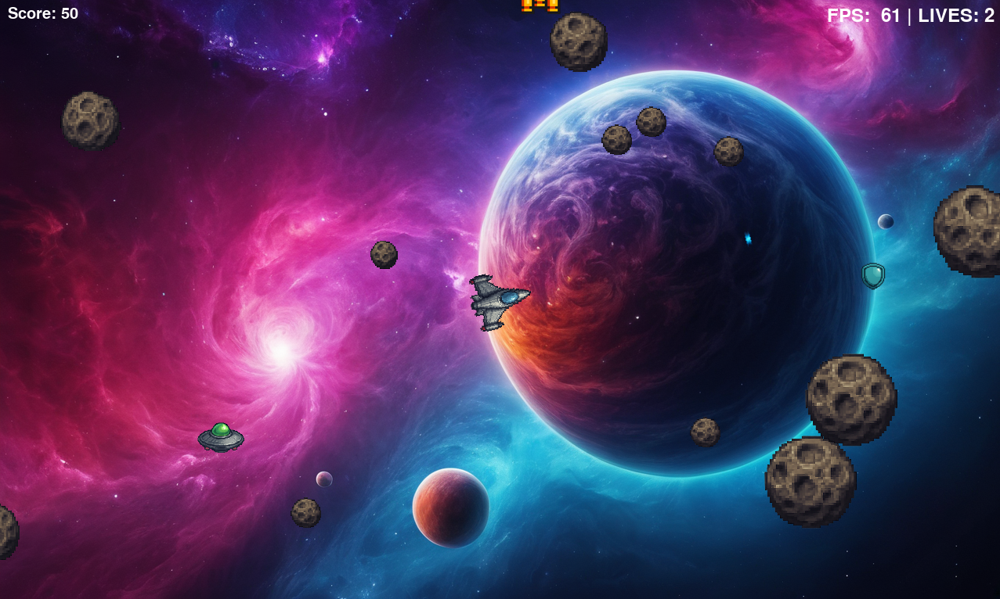

# Asteroids (Pygame)

Klasyczna gra **Asteroids** napisana w Pythonie z wykorzystaniem biblioteki **Pygame**.
Projekt zrealizowany w ramach zaliczenia przedmiotu *Programowanie w języku Python*.



---

## Spis treści

1. [Wymagania](#wymagania)
2. [Instalacja](#instalacja)
3. [Uruchamianie](#uruchamianie)
4. [Sterowanie](#sterowanie)
5. [Struktura projektu](#struktura-projektu)
6. [Konfiguracja](#konfiguracja)
7. [Licencja i kredyty](#licencja-i-kredyty)

---

## Wymagania

| Oprogramowanie     | Wersja minimalna             |
| ------------------ | ---------------------------- |
| Python             | **3.10** (testowane na 3.11) |
| SDL2 / SDL2\_Mixer | zależnie od systemu          |
| Pygame             | 2.6                          |

> **Uwaga dla systemów Linux:** przed instalacją paczki `pygame` należy doinstalować biblioteki nagłówkowe SDL2, np.
> `sudo apt install libsdl2-dev libsdl2-image-dev libsdl2-mixer-dev libsdl2-ttf-dev`

---

## Instalacja

```bash
# 1. pobierz repozytorium
git clone https://github.com/MarekPers/asteroids.git
cd asteroids

# 2. utwórz i aktywuj środowisko wirtualne
python -m venv .venv
source .venv/bin/activate      # Windows: .venv\\Scripts\\activate

# 3. zainstaluj zależności
pip install -r requirements.txt
```

---

## Uruchamianie

```bash
python main.py            # bezpośrednio z katalogu repo
```

Program tworzy okno o domyślnej rozdzielczości **1280 × 768** pikseli.
Rozdzielczość można zmienić, edytując wartości `SCREEN_WIDTH` i `SCREEN_HEIGHT` w pliku `constants.py`.

---

## Sterowanie

| Klawisz                   | Funkcja                   |
| ------------------------- | ------------------------- |
| **W**                     | ciąg do przodu (thrust)   |
| **S**                     | ciąg wsteczny (hamowanie) |
| **A**                     | obrót w lewo              |
| **D**                     | obrót w prawo             |
| **SPACJA**                | strzał                    |
| **ESC**                   | pauza / ekran pauzy       |
| **Q** lub zamknięcie okna | zakończenie gry           |

---

## Struktura projektu

```
asteroids/
├── assets/          # grafika 2D i dźwięki 
│   ├── *.png 
│   ├── asteroid/
│   │   └── *.png
│   ├── powerup/
│   │   └── *.png
│   └── sound/
│       ├── *.wav
│       └── *.mp3
│   
├── main.py          # pętla główna gry
├── constants.py     # parametry konfiguracyjne
├── player.py        # logika statku gracza
├── asteroid.py
├── asteroidfield.py
├── ufo.py
├── powerups.py
├── shots.py
├── score.py
├── screens.py       # ekrany start/pauza/koniec
└── utils.py         # funkcje pomocnicze
├── requirements.txt
└── README.md
```

---

## Konfiguracja

Większość stałych związanych z rozgrywką (prędkości, promienie kolizji, częstotliwość power‑upów) znajduje się w pliku `constants.py`.
Zmiana tych wartości nie wymaga rekompilacji – wystarczy ponownie uruchomić grę.

---

## Licencja i kredyty

Kod źródłowy udostępniany jest na licencji **MIT** (patrz plik `LICENSE`).
Grafiki i animacje zostały wygenerowane w programach **Fooocus 2‑5‑0** oraz **Dall-E 3** i udostępniane na zasadach *CC‑BY 4.0*.
Dźwięki pochodzą z bazy **opengameart.org** (autorzy wymienieni w `assets/credits.txt`).

---

> Made with ❤️  using Python 3 & Pygame
